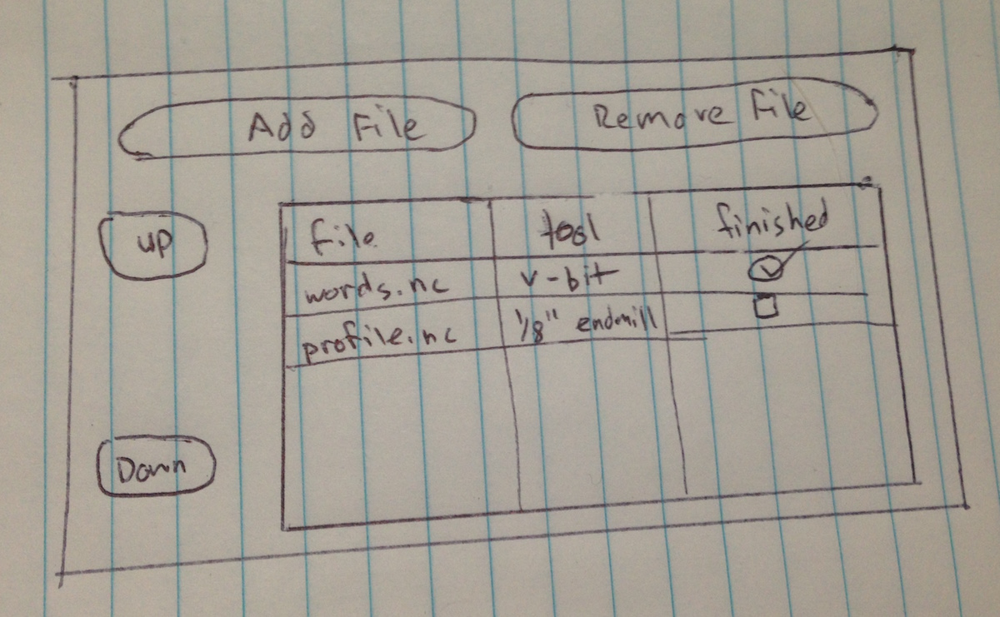
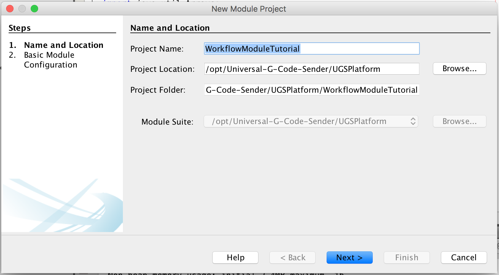
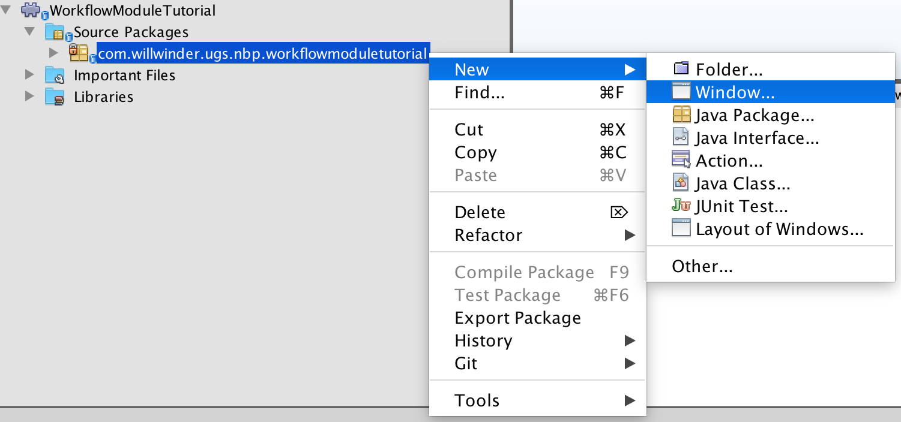
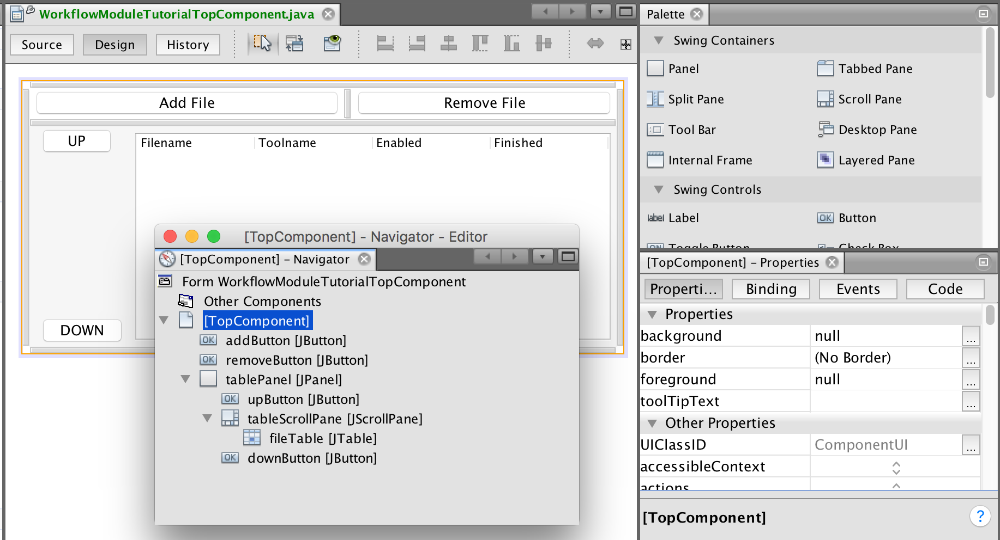
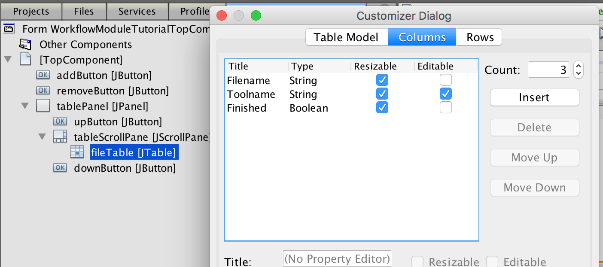
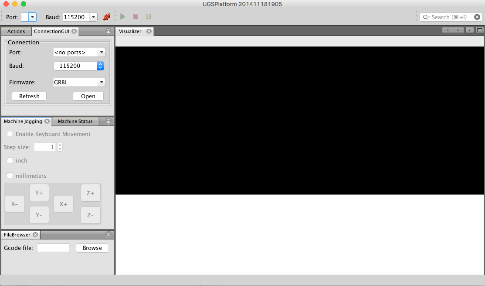

# Plugin development

The UGS Platform is built ontop of the NetBeans Platform. This gives us powerful
tools to work with, including a robust plugin system. The heart of the UGS
Platform is a module which wraps and exposes the Universal Gcode Sender JAR
file - the same jar you could execute to run the Classic GUI! Other than using
the UGSLib module, developing a plugin for the UGS Platform is exactly the same
as developing any other NetBeans Platform plugin. And there is lots of great
documentation for that! Here is the [NetBeans Platform Plugin Quick Start](https://platform.netbeans.org/tutorials/nbm-google.html)
guide.

# Workflow Plugin Tutorial

In this tutorial we're going to build a window to help manage jobs that use
multiple tools which are split into multiple tools. The rough design idea will
have a central table with four columns containing:
* File name
* Tool name (editable)
* Finished flag

There will be a pair of buttons to add and remove files from the table, and
will also hook up a lifecycle event listener for other file open events.

There will be another pair of buttons to move rows around in the table, so that
if files were added out of order the order can be corrected.

Here is a sketch of what we're building:
<center></center>


## Create and configure project
Universal Gcode Sender is developed with NetBeans, and plugins are no exception.
Once you've cloned the Universal Gcode Sender project you should be able to open
the UGSPlatform folder with NetBeans and it will discover a project that you can open.
To start building your module expand the UGSPlatform section, right-click the
modules directory and select `Add New...`.

<center></center>

This will open up a wizard where you name the module, and declare the source
path. For this example the module is named WorkflowModuleTutorial and the source
path is com.willwinder.ugs.nbp.workflowmoduletutorial which is the convention
used in the core modules.

<center></center>

## Add UGS dependencies

Your module should now be listed in the Modules section. If it doesn't you may
need to restart NetBeans. Before we dive into the code there are a couple helper
classes to import which will give you full access to the UGS API. Double click
your module from the Modules section to open the code, then right-click the top
level item which appeared and select the properties menu.

Select `Add Dependency...`, here you should search for `UGSLib` and
`CentralLookup` then add them to your plugin.

<center></center>

## Create window class

Now we're ready to build the module. In this tutorial we're building a window
to manage a multi-job workflow, so we'll start by adding a window to customize.

1. Open the new module and right click the new package, in the context menu go to
`New` -> `Window...`. To bring up the new window wizard.
2. In the first screen of the wizard choose the default location your window
will appear. Custom locations have been designed for UGS Platform, the largest
is named `visualizer` because it is the Visualizer's default location. We'll
use this location for our plugin.  This means that when our plugin opens it will
be tabbed with the Visualizer module.
3. Click next and choose a class name for your module, for this tutorial I'm
going to call it `WorkflowModuleTutorial`.

<center></center>

## Build the GUI

The NetBeans GUI builder makes it easy to make a custom user interface without
writing a single line of code (which is the main reason UGS uses NetBeans!).
Using the GUI builder we'll add some buttons and a table. This step can be as
elaborate as you want. If you're a seasoned swing developer and prefer not to
use the magic GUI builder, no worries, you can create the UI programatically as
well - but that is a different tutorial.

* Take a look at the screenshot below. The `[TopComponent] - Navigator - Editor`
  window shows all the objects that have been added with the GUI builder.
* There are four JButtons, a JTable nested inside a JScrollPane and a JPanel
  which I used to make alignment a little easier (The GUI Builder is powerful,
  but it can also be a bit quirky).
* Putting the JTable inside a JScrollPane makes it so that if too many items
  get added to the table it will scroll rather than dissapear off the bottom.
* **Note:** The name given to these components will be used in the code, so
  be sure to use the names shown in the screenshot.

<center></center>

The JTable is going to be the trickiest part of build the GUI. To configure the
table right-click the JTable object from the component navigator and select
`Table Contents...`. Here you can add our 3 columns and specify that the data
types. You can also specify which columns are editable, in this example we want
the user to be able to type in what type of tool should be used.

<center></center>

## Autogenerated code

Before writing any code, lets take a look at what has already been automatically
generated for us.

1. Just above the class there are a number of annotations. These are used by
   the NetBeans platform, most of them were setup according to how you filled
   in the Wizards earlier. They can also configure things like keyboard
   shortcuts, and where things are put in the dropdown menus.

2. Within the class there are several grayed out sections. This is code
   generated by NetBeans which the IDE prevents you from modifying outside the
   GUI builder or in some cases component properties. For example if you wanted
   to use a custom JTable, you would configure the table in the GUI builder by
   adding a custom constructor.

3. At the end of the file is `componentOpened` and `componentClosed`, these are
   lifecycle events that are called when the window has been opened or closed.

4. Also at the end of the file is `writeProperties` and `readProperties`, these
   are used to save the window state between runs.

## Annotated code

This is the longest section because it will explain every line of code added to
the `WorkflowModuleTutorial` class. The most complicated code deals with Swing
component manipulation, with just a smattering of UGS lifecycle events to push
things along.

### Class signature

* First there are a few class state object we'll need and two Listeners we'll
  be implementing.
```java
/**
 * UGSEventListener - this is how a plugin can listen to UGS lifecycle events.
 * ListSelectionListener - listen for table selections.
 */
public final class WorkflowWindowTutorialTopComponent
        extends TopComponent
        implements UGSEventListener, ListSelectionListener {

    // These are the UGS backend objects for interacting with the backend.
    private final Settings settings;
    private final BackendAPI backend;

    // This is used to identify when a stream has completed.
    private boolean wasSending;

    // This is used in most methods, so cache it here.
    DefaultTableModel model;
```

### Constructor

* In the constructor we register the class with the UGS backend and also set
  the class as a listener to table selection events.
``` java
    public WorkflowWindowTopComponent() {
        initComponents();
        setName(Bundle.CTL_WorkflowWindowTopComponent());
        setToolTipText(Bundle.HINT_WorkflowWindowTopComponent());

        // This is how to access the UGS backend and register the listener.
        // CentralLookup is used to get singleton instances of the UGS
        // Settings and BackendAPI objects.
        settings = CentralLookup.getDefault().lookup(Settings.class);
        backend = CentralLookup.getDefault().lookup(BackendAPI.class);
        backend.addUGSEventListener(this);

        // Allow contiguous ranges of selections and register a listener.
        this.fileTable.setSelectionMode(
            ListSelectionModel.SINGLE_INTERVAL_SELECTION);
        ListSelectionModel cellSelectionModel =
            this.fileTable.getSelectionModel();
        cellSelectionModel.addListSelectionListener(this);

        // Cache the model object.
        model = (DefaultTableModel)this.fileTable.getModel();
    }
```

### UGS Event Listener

* This is the event sent from the UGS Backend, when a file is loaded or the
  state changes a notification will be sent.
* If the state switches from `COMM_SENDING` to `COMM_IDLE` we'll run a
  `completeFile` method.
* If a file is loaded, we add it to the table.
```java
    @Override
    public void UGSEvent(UGSEvent cse) {
        if (cse.isStateChangeEvent()) {
            if (wasSending && cse.getControlState() == ControlState.COMM_IDLE)
               this.completeFile(backend.getGcodeFile());
            wasSending = backend.isSending();
        }
        if (cse.isFileChangeEvent()) {
            this.addFileToWorkflow(backend.getGcodeFile());
        }

    }
```

### File Complete Handler

* When a command is complete we'll update the JTable, select the next file that
  needs to be sent and popup a notification informing the user what they should
  do next. The selection event will be sent and handled in the selection
  handler.
```java
    public void completeFile(File gcodeFile) {
        if (gcodeFile == null) return;

        // Make sure the file is loaded in the table.
        int fileIndex = findFileIndex(gcodeFile);
        if (fileIndex < 0) return;

        // Mark that it has been completed.
        model.setValueAt(true, fileIndex, 2);

        fileIndex++;
        String message;

        // Make sure there is another command left.
        if (fileIndex < fileTable.getRowCount()) {
            String nextTool = (String) model.getValueAt(fileIndex, 1);
            String messageTemplate =
                   "Finished sending '%s'.\n"
                 + "The next file uses tool '%s'\n"
                 + "Load tool and move machine to its zero location\n"
                 + "and click send to continue this workflow.";
            message = String.format(
                messageTemplate, gcodeFile.getName(), nextTool);

            // Select the next row, this will trigger a selection event.
            fileTable.setRowSelectionInterval(fileIndex, fileIndex);
            
        // Use a different message if we're finished.
        } else {
            message = "Finished sending the last file!";
        }

        // Display a notification.
        java.awt.EventQueue.invokeLater(() -> {
            JOptionPane.showMessageDialog(new JFrame(), message, 
                    "Workflow Event", JOptionPane.PLAIN_MESSAGE);
        });
    }
```

### JTable Selection Listener

* This is the selection listener, when a file is selected load it in the backend.
```java
    @Override
    public void valueChanged(ListSelectionEvent e) {
        int[] selectedRow = fileTable.getSelectedRows();
        // Only load files when there is a single selection.
        if (selectedRow.length == 1) {
            // Pull the file out of the table and set it in the backend.
            String file = (String) model.getValueAt(selectedRow[0], 0);
            try {
                backend.setGcodeFile(new File(file));
            } catch (Exception ex) {
                Exceptions.printStackTrace(ex);
            }
        }
    }
```

### JTable Helper

* Helper method to add a file to the JTable, first making sure that it isn't
  already in the table.
```java
    public void addFileToWorkflow(File gcodeFile) {
        if (gcodeFile == null) {
            return;
        }

        int fileIndex = findFileIndex(gcodeFile);
        // Don't re-add a file.
        if (fileIndex >= 0) {
            return;
        }

        model.addRow(new Object[]{
                gcodeFile.getAbsolutePath(),
                "default",
                false
            });

        // Fire off the selection event to load the file.
        int lastRow = fileTable.getRowCount() - 1;
        fileTable.setRowSelectionInterval(lastRow, lastRow);
    }
```

### Add/Remove Button Action Handlers

* Now we implement the button event methods. They are generated by double
  clicking the buttons in the GUI Builder. This generates the swing code that
  attaches the `ActionPerformed` events to the button click callbacks.
* `addButtonActionPerformed` simply displays a file chooser (using some UGS
  library built ins) and calls the `addFileToWorkflow` method defined earlier.
* `removeButtonActoinPerformed` is even simpler, it uses standard JTable
  functionality to remove any selected rows. The only thing clever here is that
  rows are removed starting from the end to avoid having the index of later
  selections change while deleting rows one at a time.
```java
    private void addButtonActionPerformed(ActionEvent evt) {                                          
        // Open a file chooser pointing at the last opened directory.
        JFileChooser fileChooser = GcodeFileTypeFilter.getGcodeFileChooser(
            settings.getLastOpenedFilename());

        int returnVal = fileChooser.showOpenDialog(this);
        if (returnVal == JFileChooser.APPROVE_OPTION) {
            File gcodeFile = fileChooser.getSelectedFile();

            // Save the new directory!
            settings.setLastOpenedFilename(gcodeFile.getParent());

            addFileToWorkflow(gcodeFile);
        }  
    }                                         

    private void removeButtonActionPerformed(ActionEvent evt) {                                             
        int[] selectedRows = fileTable.getSelectedRows();
        if (selectedRows.length == 0) return;

        Arrays.sort(selectedRows);
        for (int i = selectedRows.length - 1; i >= 0; i--) {
            int row = selectedRows[i]
            this.model.removeRow(row);
            this.model.fireTableRowsDeleted(row, row);
        }
    }                                            
```

### Up / Down Button Action Handlers

* The up and down action buttons are pure java code. They don't do anything
  you wouldn't do with any other Swing application. The code here deals strictly
  with moving selections around. Although a little tricky, and not totally
  relevant to UGS, they are included because the feature wouldn't be complete
  without them.
```java
    private void upButtonActionPerformed(ActionEvent evt) {                                         
        int[] selectedRows = fileTable.getSelectedRows();

        // Exit early if nothing is selected.
        if (selectedRows.length == 0) return;

        Arrays.sort(selectedRows);

        // Exit early if the selected range can't move.
        if (selectedRows[0] == 0) return;

        for (int i = 0; i < selectedRows.length; i++) {
            selectedRows[i] = this.moveRow(selectedRows[i], -1);
        }

        int first = selectedRows[0];
        int last = selectedRows[selectedRows.length-1];
        fileTable.setRowSelectionInterval(first, last);
    }                                        

    private void downButtonActionPerformed(ActionEvent evt) {                                           
        int[] selectedRows = fileTable.getSelectedRows();

        // Exit early if nothing is selected.
        if (selectedRows.length == 0) return;

        Arrays.sort(selectedRows);

        // Exit early if the selected range can't move.
        if (selectedRows[selectedRows.length-1]
                == fileTable.getRowCount()) return;

        for (int i = selectedRows.length - 1; i >= 0; i--) {
            selectedRows[i] = this.moveRow(selectedRows[i], 1);
        }

        int first = selectedRows[0];
        int last = selectedRows[selectedRows.length-1];
        fileTable.setRowSelectionInterval(first, last);
    } 
```

### NetBeans Platform Component Lifecycle Code

* Of the automatically generated methods, `componentOpened` is the only one
  which needed some custom code. In case the component had been closed earlier
  or wasn't loaded until after a file stream started, grab the `wasSending`
  state and save it for later.
```java
    @Override
    public void componentOpened() {
        this.wasSending = backend.isSending();
    }

    @Override
    public void componentClosed() {
        // No special close handling.
    }

    void writeProperties(java.util.Properties p) {
        // better to version settings since initial version as advocated at
        // http://wiki.apidesign.org/wiki/PropertyFiles
        p.setProperty("version", "1.0");

        // We could save the loaded files here
    }

    void readProperties(java.util.Properties p) {
        String version = p.getProperty("version");

        // We could load previously loaded files here
    }
```

### Helper Methods

* Finally, here are the helper methods used above.
```java
    /**
     * Look for the provided file in the file table.
     */
    private int findFileIndex(File gcodeFile) {
        if (gcodeFile == null) return -1;

        for (int i = 0; i < model.getRowCount(); i++) {
            String file = (String) model.getValueAt(i, 0);
            if (file != null && gcodeFile.getAbsolutePath().equals(file)) {
                return i;
            }
        }

        return -1;
    }

    /**
     * Move a given row by some offset. If the offset would move the row outside
     * of the current table size, the row is not moved.
     */
    private int moveRow(int row, int offset) {
        int dest = row + offset;
        if (dest < 0 || dest >= model.getRowCount()) {
            return row;
        }

        model.moveRow(row, row, dest);
        return dest;
    }
```

## Conclusion

Here is a quick screencast of what this plugin does for us. In the GUI builder I swapped in some up/down arrows compared to the tutorial.

<center></center>

