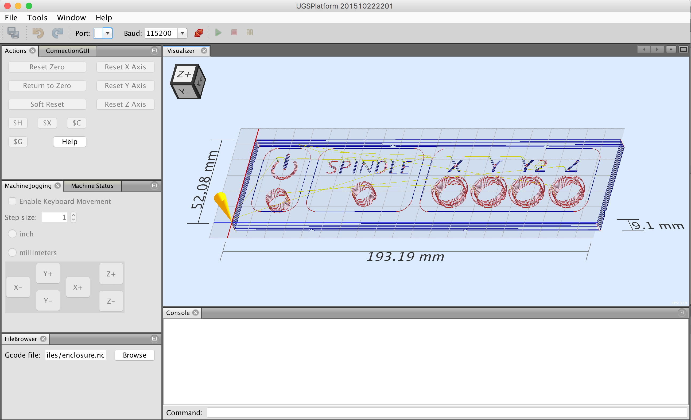
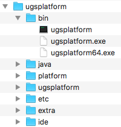
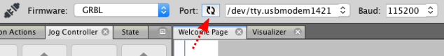
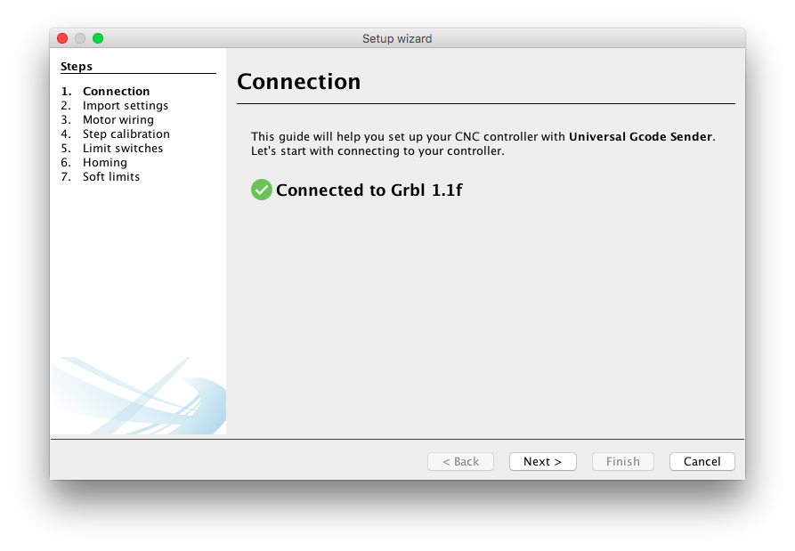
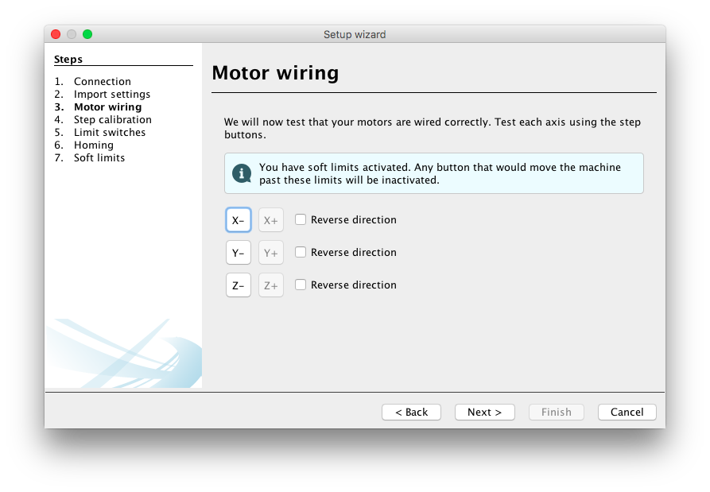
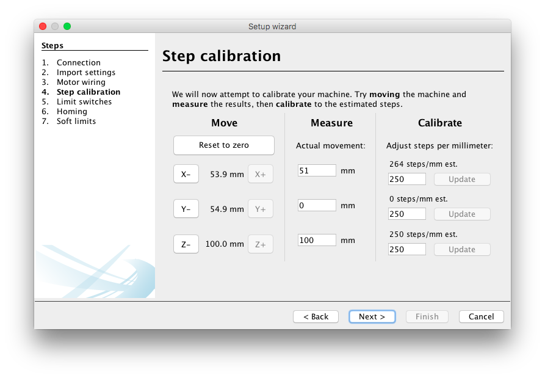
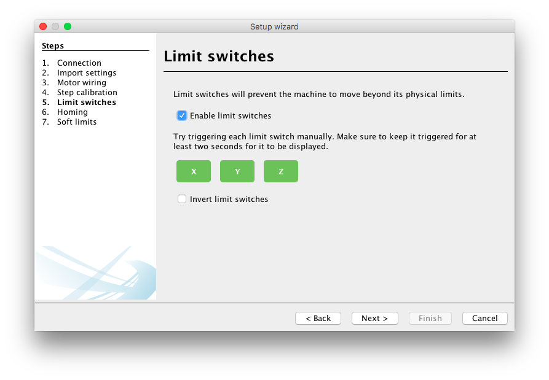
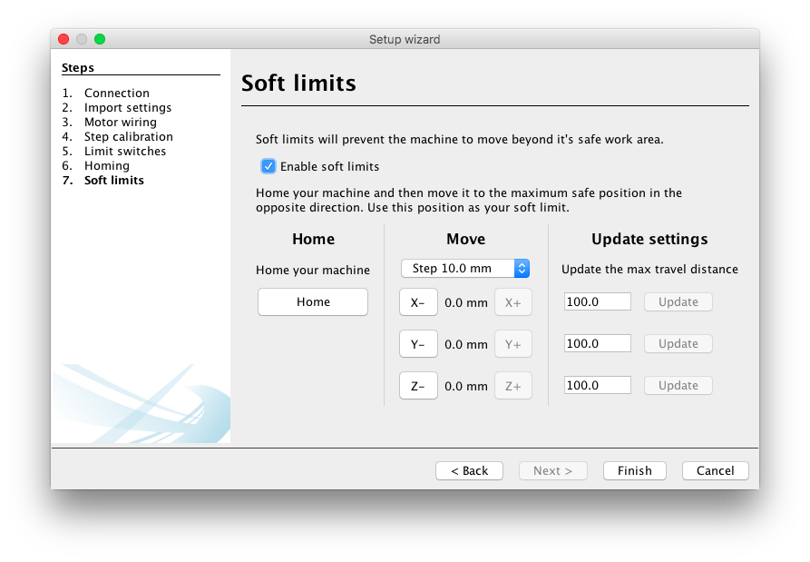
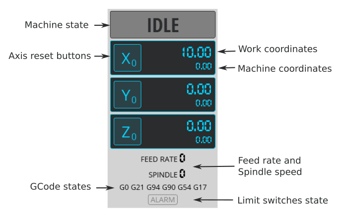

# UGS Platform

The UGS Platform is the next generation of Universal Gcode Sender. It is built
ontop of the Netbeans Platform which allows us to leverage its mature modular
framework. This platform allows more features to be added without compromising
on code quality, or being bogged down by a home grown framework. The Classic
GUI is used as a library, so core features benefit both interfaces.  

## Platform Benefits

* This is the current target for new UGS features.
* Out of the box dynamic windowing system allows arranging the UI dynamically.
* Plugin Framework available for decoupling features.
* Huge library of modules to leverage: Code Editors, Auto-updates, Keybindings

# Usage 

## How to run

1. Download and install the version of Java listed on the download page, [or a later version.][java_download_link]
2. [Download and extract the UGS Platform build from the downloads page.](../download.md)
3. Go to the `ugsplatform/bin` directory.
4. On Windows run `ugsplatform.exe` or `ugsplatform64.exe`. On Linux or Mac OSX run `ugsplatform`.  

[java_download_link]: https://www.google.com/url?sa=t&rct=j&q=&esrc=s&source=web&cd=2&ved=0ahUKEwi05PP5z6_LAhXDvIMKHRyyB5UQFggoMAE&url=http%3A%2F%2Fwww.oracle.com%2Ftechnetwork%2Fjava%2Fjavase%2Fdownloads%2Fjre8-downloads-2133155.html&usg=AFQjCNH7hWo8nDItPkEtYqoPreE_9QPZkw&cad=rja

## Connecting to the controller
Start off by connecting to your controller hardware using the toolbar at the top of the program. 

* Select the correct hardware in the firmware combo box:    
* Refresh the serial ports list and select the correct port for your hardware. If you can't find the correct port in the list, make sure you have the drivers installed.    The ports are usually named like this:  - **MacOSX**: `/dev/tty.usbmodem*` or `/dev/tty.usbserial*`   - **Linux**: `/dev/ttyUSB*` or `/dev/ttyACM*`   - **Windows**: `COM1`, `COM2` and so on.  
* Select the correct baud rate for your controller.   - **GRBL** - version 0.9 or later are using 115200, earlier versions are using 9600.   - **TinyG/g2core** will adapt to the baud rate you are connecting with so it really doesn't matter.

## Setup wizard
Do you need help configuring your hardware? In that case the setup wizard might be helpful, it will allow you to configure limit switches, homing, soft limits and calibrating your machine.

* To start the wizard open the menu `Machine -> Setup wizard...`  
* If you aren't connected to your controller a connection dialog will be presented:  
* The version of the controller will be shown after connecting and the available setup steps will be loaded for your controller: 
* If you have a settings file from your machine manufacturer or if you have a backup of your settings you may import it here: 
* On the motor wiring configuration page you can test the direction of your motors and change its direction if needed.  
* On the step calibration page you can move the machine and measure the actual distance. It will then recommend a step setting for your machine:  
* If you have limit switches you may enable them on this page and test if they are firing correctly:  
* If limit switches are enabled you may enable homing as well. This page helps you figuring out in which direction the homing should be made:  
* If homing is enabled you may also configure soft limits so that the controller knows if it can process a command without triggering limit switches:  

## Digital read-out 
The Digital read-out (or Controller state) panel displays the current status of your machine such as the work/machine coordinates, machine/spindle speeds and gcode states.

The panel provides the following functions:

* Coordinates of both the machine and your current work
* Buttons for resetting the work coordinates for each axis
* Changable work coordinates using simple mathematical expressions.   You can either set an exact coordinate or, as an example, use the following `# / 2` to divide the current position in half. The `#`-character will be replaced with current position. If you start your expression with `*` or `/` the current position is prepended.   
* Display the current machine state (Idle, Run, Jog, Alarm, etc.)
* Display the current feed rate and spindle speed
* Display the different GCode states
* Display alarm with the triggered limit switches

## Overrides
With the overrides plugin you can tweak the running session of a gcode program in real time. You can speed up/down the feed rate, spindle and the fast movement. To use, open the menu `Window -> Overrides`.  

