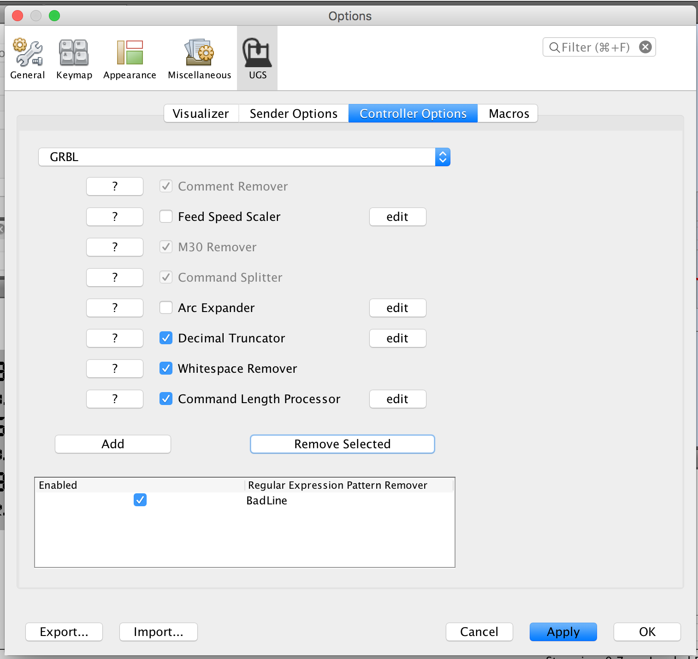

# Common Problems

## "Grbl has not finished booting."

This happens when UGS connects to a serial port and does not receive the GRBL startup string. Typically this is caused by a configuration problem and can be solved by one of the following:

1. Check the baud rate is 115200, or 9600 for very old versions of grbl.
2. Make sure you are connecting to the correct port.
3. Make sure you have installed any drivers required for your controller.
4. Make sure GRBL is properly flashed on your controller.

## Gcode program stopped working

The UGS Parser has a configurable list of rules to skip certain patterns, these rules are typically added by a Yes/No dialog asking if you would like to skip the erroneous commands in the future. Sometimes GRBL will get into an ALARM state and there will be lots of these popups which should not be skipped in the future.

Skipping good commands may lead to broken gcode. Those rules should be removed from the gcode processor by going into the controller options.

In UGS Classic the option is in <b>Settings > Gcode Processor Configuration</b>.

In UGS Platform the option is under <b>Preferences... > UGS > Controller Options</b>.

For both, you need to uncheck or remove the invalid settings in the bottom list:

# Platform Specific Issues

## Toolbars or Windows don't appear.

This usually happens if you try running the platform without the required version of Java. The user cache is initialized but some objects become corrupt and initialization fails in the future even after upgrading Java.

This can be fixed by clearing out the user cache directory which can be found on the UGS "About" screen seen in the image below.
 

##
