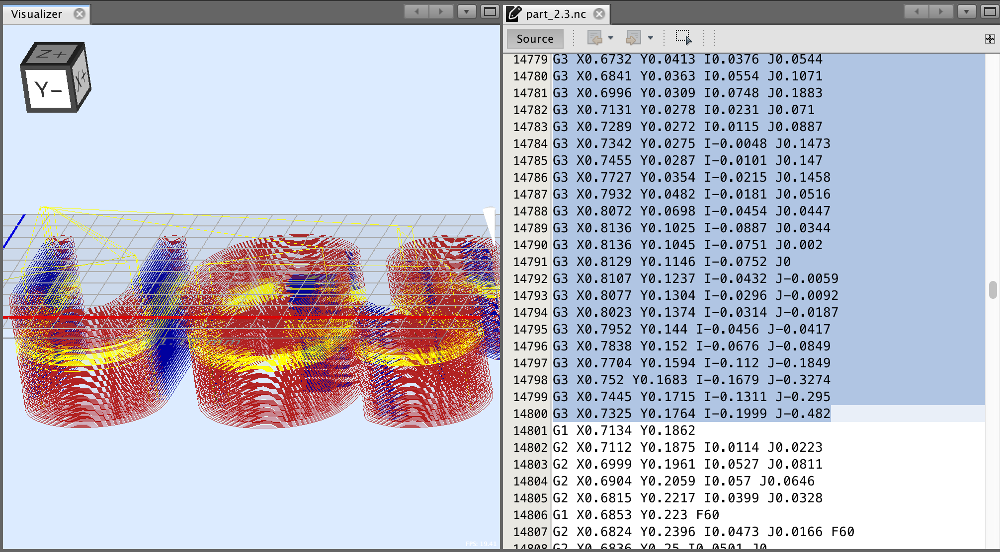
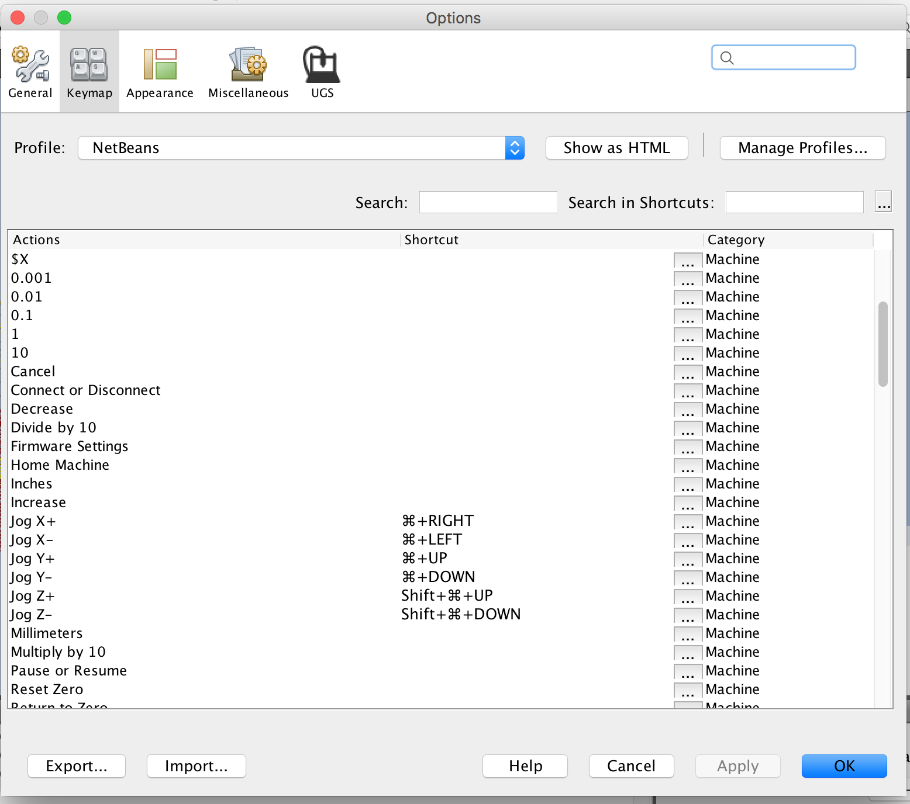
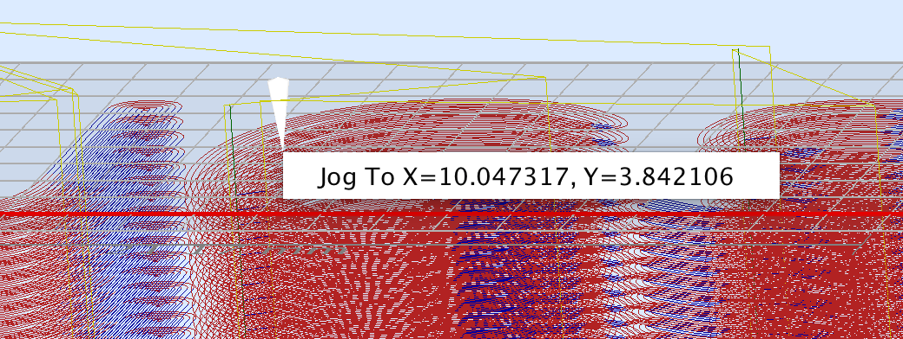

A free and full featured gcode platform used for interfacing with advanced CNC controllers like [GRBL](https://github.com/grbl/grbl)
, [FluidNC](http://wiki.fluidnc.com/), [TinyG](https://github.com/synthetos/TinyG), [g2core](https://github.com/synthetos/g2) and [Smoothieware](http://smoothieware.org/).
Universal Gcode Sender is a self-contained Java application which includes all external dependencies and can be used on most computers running Windows, MacOSX or Linux. 
 

  <!-- Badges -->
  [![Language][java_version_img]][java_version_link]
  [![License][license_img]][license_link]
  [![Build Status][travis_img]][travis_link]
  [![GitHub Release Date][release_img]][release_link]
<!--
  How to deal with github stars?
  [![Stars][github_img]][github_link]
<iframe src="https://ghbtns.com/github-btn.html?user=winder&repo=Universal-G-Code-Sender&type=star&count=true" frameborder="0" scrolling="0" width="170px" height="20px"></iframe>
<iframe src="https://ghbtns.com/github-btn.html?user=winder&repo=Universal-G-Code-Sender&type=star&count=true&size=large" frameborder="0" scrolling="0" width="160px" height="30px"></iframe>
-->

-------------

## Features
* Cross platform, can run on Windows, MacOSX, Linux, and Raspberry Pi
* Configurable user interface
* 3D Gcode Visualizer with color coded line segments and real time tool position feedback
* Real time overrides
* G-code editor
* Designer editor (with laser engraver support)
* Configuratble gcode optimization:
    * Remove comments
    * Truncate decimal precision to configurable amount
    * Convert arcs (G2/G3) to line segments
    * Remove whitespace
* Support for Gamepads and Joysticks
* Web pendant interface

# Screenshots
*Fully modular GUI, reconfigure windows to suite your needs.*

*Built in gcode editor with line highlighter and syntax highlighting*

*Built in designer with support for importing SVG/DXF/PNG/JPG*

*Customizable keybindings.*

*Zoom to selection with command and drag.*

*Right click in the visualizer to jog to a specific XY location.*

-------------

# Sponsors

-------------

# Donations

Universal Gcode Sender is free software developed and maintained in my free time for the hobby cnc community. If you would like to make a monetary donation, all proceeds will be used to try convincing my wife that it is worth my time.

<form action="https://www.paypal.com/cgi-bin/webscr" method="post" target="_top">
  <!-- donation amounts -->
  <input type="radio" name="amount" value="1">$1
  <input type="radio" name="amount" value="5" checked>$5
  <input type="radio" name="amount" value="10">$10
   
  <input type="radio" name="amount" value="25">$25
  <input type="radio" name="amount" value="">Custom amount
   

  <input type="hidden" name="cmd" value="_donations">
  <input type="hidden" name="business" value="wwinder.unh@gmail.com">
  <input type="hidden" name="lc" value="US">
  <input type="hidden" name="item_name" value="Universal Gcode Sender">
  <input type="hidden" name="item_number" value="UGS Website Donate Button">
  <input type="hidden" name="no_note" value="0">
  <input type="hidden" name="currency_code" value="USD">
  <input type="hidden" name="bn" value="PP-DonationsBF:btn_donateCC_LG.gif:NonHostedGuest">
  <input type="image" src="https://www.paypalobjects.com/en_US/i/btn/btn_donateCC_LG.gif" border="0" name="submit" alt="PayPal - The safer, easier way to pay online!">
  
</form>

[java_version_img]: img/shields/Language-Java-brightgreen.svg
[java_version_link]: https://java.com/en/download/manual.jsp
[license_img]: img/shields/License-GPLv3-blue.svg
[license_link]: http://www.gnu.org/licenses/quick-guide-gplv3.en.html
[travis_img]: https://travis-ci.org/winder/Universal-G-Code-Sender.svg?branch=master
[travis_link]: https://travis-ci.org/winder/Universal-G-Code-Sender
[github_img]: https://img.shields.io/badge/Star-123-green.svg?style=social
[github_link]: https://github.com/winder/Universal-G-Code-Sender
[release_img]: https://img.shields.io/github/release/winder/Universal-G-Code-Sender
[release_link]: download/
