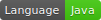
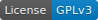

## Universal Gcode Sender
-------------

A full featured gcode platform used for interfacing with advanced CNC controllers like [GRBL](https://github.com/grbl/grbl)
and [TinyG](https://github.com/synthetos/TinyG).
Universal Gcode Sender is a self-contained Java application which includes all external dependencies,
that means if you have the Java runtime environment setup UGS provides the rest.
 
<!--

<iframe src="https://ghbtns.com/github-btn.html?user=winder&repo=Universal-G-Code-Sender&type=star&count=true" frameborder="0" scrolling="0" width="170px" height="20px"></iframe>
<iframe src="https://ghbtns.com/github-btn.html?user=winder&repo=Universal-G-Code-Sender&type=star&count=true&size=large" frameborder="0" scrolling="0" width="160px" height="30px"></iframe>
-->

-------------

## Downloads
See the [Downloads page](download.md).

-------------

## Features
* Cross platform, tested on Windows, OSX, Linux, and Raspberry Pi.
* Executable All-In-One JAR file - if you have java there is nothing to install. The JAR file includes native dependencies for all supported operating systems.
* 3D Gcode Visualizer with color coded line segments and real time tool position feedback.
* Duration estimates.
* Over 3000 lines of unit test code, and another 1000 lines of comments documenting the tests.
* Configuratble gcode optimization:
    * Remove comments
    * Truncate decimal precision to configurable amount
    * Convert arcs (G2/G3) to line segments
    * Remove whitespace

-------------

## Screenshots

